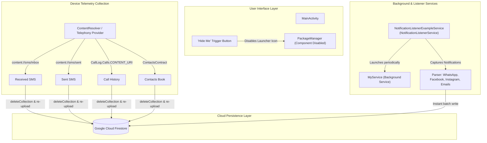

# SpyAppClient

An Android background monitoring and telemetry synchronization client engineered to capture device telecommunications (SMS messages, call logs, contacts) and intercepted third-party application notifications (WhatsApp, Facebook, Messenger, Instagram, Email), exfiltrating collected data to Google Cloud Firestore.

---

## Table of Contents
1. [Architecture Overview](#architecture-overview)
2. [Component Breakdown](#component-breakdown)
3. [Dependencies](#dependencies)
4. [Permissions & Security Analysis](#permissions--security-analysis)
5. [How the Project Gets Built](#how-the-project-gets-built)
6. [Known Build Issues & Fixes](#known-build-issues--fixes)
7. [How to Sign the Application](#how-to-sign-the-application)
8. [Next Steps & Roadmap](#next-steps--roadmap)
9. [Legal & Ethical Disclaimer](#legal--ethical-disclaimer)

---

## Architecture Overview



### High-Level Workflow
1. **Activation**: The user launches `MainActivity`, which requests necessary runtime permissions (`READ_SMS`, `READ_CALL_LOG`, `READ_CONTACTS`, etc.).
2. **Notification Listener Authorization**: The application prompts the user via an `AlertDialog` to grant Notification Listener access in the system settings (`Settings.ACTION_NOTIFICATION_LISTENER_SETTINGS`).
3. **Execution & Stealth Mode**: Upon tapping the button (`R.id.btn`):
   - The launcher icon is disabled using `PackageManager.setComponentEnabledSetting(..., COMPONENT_ENABLED_STATE_DISABLED, DONT_KILL_APP)`, causing the application icon to disappear from the launcher drawer.
   - Initial synchronization to Firebase Firestore is triggered.
   - Background `Timer` tasks are scheduled to periodically poll local telephony content providers, clear previous Firestore collection batches, and re-upload fresh telemetry.
4. **Active Notification Interception**: `NotificationListenerExampleService` runs continuously as an authorized system notification listener, filtering incoming status bar notifications for target packages (WhatsApp, Facebook, Instagram, email apps), extracting text and metadata, and persisting them in real-time to Cloud Firestore.

---

## Component Breakdown

| Component | Path | Responsibility |
| :--- | :--- | :--- |
| **`MainActivity`** | `app/src/main/java/com/1337tools/MainActivity.java` | Entry point UI, runtime permission requests, notification listener status checks, launcher stealth toggle, and periodic telemetry sync scheduler. |
| **`NotificationListenerExampleService`** | `app/src/main/java/com/1337tools/NotificationListenerExampleService.java` | Extends `NotificationListenerService`. Intercepts incoming `StatusBarNotification` events, matches against target package identifiers, and writes intercepted message contents to Firestore. |
| **`MyService`** | `app/src/main/java/com/1337tools/MyService.java` | Background service that runs repeating timers to synchronize Call Logs, Sent SMS, and Received SMS to Firestore. |
| **`CallLog`** | `app/src/main/java/com/1337tools/CallLog.java` | Model class representing phone number, call type (INCOMING, OUTGOING, MISSED), timestamp, and call duration. |
| **`Contact`** | `app/src/main/java/com/1337tools/Contact.java` | Model class representing contact display name and phone number. |
| **`Sms`** | `app/src/main/java/com/1337tools/Sms.java` | Model class representing SMS sender/recipient address and message body. |
| **`Notification`** | `app/src/main/java/com/1337tools/Notification.java` | Model class representing intercepted notification type, content, timestamp, and sender. |

---

## Dependencies

The project uses the **Firebase Android BoM (Bill of Materials)** to manage Google cloud library versions.

### Top-Level Build Dependencies (`build.gradle`)
* **Android Gradle Plugin (AGP)**: `com.android.tools.build:gradle:9.4.1` (or modern AGP 8.x/9.x compatible with installed Gradle)
* **Google Services Plugin**: `com.google.gms:google-services:4.4.2`
* **Gradle Toolchain**: `foojay-resolver-convention:1.0.0`

### Module-Level Dependencies (`app/build.gradle`)
```groovy
dependencies {
    implementation fileTree(dir: 'libs', include: ['*.jar'])

    // Support & UI Libraries
    implementation 'androidx.appcompat:appcompat:1.8.0'
    implementation 'androidx.constraintlayout:constraintlayout:2.2.2'

    // Firebase BoM & Services
    implementation platform('com.google.firebase:firebase-bom:34.19.0')
    implementation 'com.google.firebase:firebase-auth'
    implementation 'com.google.firebase:firebase-analytics'
    implementation 'com.google.firebase:firebase-firestore'

    // Testing
    testImplementation 'junit:junit:4.13.2'
    androidTestImplementation 'androidx.test.ext:junit:1.3.0'
    androidTestImplementation 'androidx.test.espresso:espresso-core:3.7.0'
}
```

### Firebase Configuration
Firebase configuration is read from `app/google-services.json`:
* **Project ID**: `radmin-6520f`
* **Package Name**: `com.android.tooling1337`
* **Storage Bucket**: `radmin-6520f.firebasestorage.app`

---

## Permissions & Security Analysis

The application requests 19 distinct permissions in [`AndroidManifest.xml`](app/src/main/AndroidManifest.xml). Below is a comprehensive breakdown:

| Permission | Protection Level | Purpose in App | Modern Android / Play Store Status |
| :--- | :--- | :--- | :--- |
| `RECEIVE_SMS` | Dangerous | Intercepts incoming SMS broadcasts | Highly restricted under Google Play SMS/Call Log Policy. |
| `READ_SMS` | Dangerous | Queries `content://sms/inbox` and `content://sms/sent` to read full message history | Restricted; requires default SMS handler status or explicit exception. |
| `SEND_SMS` | Dangerous | Declared for sending outgoing SMS | Restricted. |
| `READ_CALL_LOG` | Dangerous | Queries `CallLog.Calls.CONTENT_URI` to read device call history and durations | Restricted; requires default phone/dialer status or explicit exception. |
| `READ_CONTACTS` | Dangerous | Queries `ContactsContract` for contact names and phone numbers | Requires runtime permission grant from user. |
| `WRITE_CONTACTS` | Dangerous | Declared in manifest | Not actively used in code. |
| `READ_PHONE_STATE` | Dangerous | Inspects telephony state (incoming call, SIM status) | Requires runtime permission. |
| `PROCESS_OUTGOING_CALLS`| Dangerous | Monitors outgoing dialed numbers | **Deprecated in API 29**; replaced by `CallRedirectionService`. |
| `RECORD_AUDIO` | Dangerous | Microphone recording | Declared and requested, but recorder code not yet implemented. |
| `CAMERA` | Dangerous | Hardware camera access | Declared in manifest. |
| `ACCESS_FINE_LOCATION` | Dangerous | GPS location capture | Declared in manifest. |
| `WRITE_EXTERNAL_STORAGE`| Dangerous | File storage modification | Deprecated for scoped storage (Android 10+). |
| `RECEIVE_BOOT_COMPLETED`| Normal | Autostarts background operations on system reboot | Requires manifest declaration. |
| `SYSTEM_ALERT_WINDOW` | Signature/Special | Displays floating overlays over other applications | Requires explicit user grant via system settings. |
| `CALL_PHONE` | Dangerous | Initiates phone calls directly | Declared in manifest. |
| `INTERNET` | Normal | Exfiltrates data over HTTP/gRPC to Firebase Cloud Firestore | Standard network access. |
| `ACCESS_NETWORK_STATE` | Normal | Checks network availability before synchronization | Standard connectivity access. |
| `WAKE_LOCK` | Normal | Keeps CPU awake during background exfiltration | Standard wake lock. |
| `VIBRATE` | Normal | Device haptic feedback | Standard haptic access. |

### Special Permissions
* **Notification Listener Service (`BIND_NOTIFICATION_LISTENER_SERVICE`)**:
  Protected by system-level signature permissions. The user must manually navigate to:
  `Settings > Apps & Notifications > Special app access > Notification access`
  and explicitly enable the app.

---

## How the Project Gets Built

### Prerequisites
* **Java Development Kit (JDK)**: JDK 17 or JDK 21
* **Android SDK**: Compile SDK `37`, Build Tools, Android Platform 37
* **Gradle**: Managed via Gradle wrapper or Android Studio build system

### Gradle Build Commands

#### 1. Assemble Debug APK
Compiles the app using debug signing credentials:
```bash
./gradlew :app:assembleDebug
```
The output APK will be generated at:
`app/build/outputs/apk/debug/app-debug.apk`

#### 2. Assemble Release APK (Unsigned)
Compiles an optimized release build:
```bash
./gradlew :app:assembleRelease
```
The output APK will be generated at:
`app/build/outputs/apk/release/app-release-unsigned.apk`

#### 3. Build Android App Bundle (AAB)
Compiles the bundle suitable for Google Play:
```bash
./gradlew :app:bundleRelease
```
The output AAB will be generated at:
`app/build/outputs/bundle/release/app-release.aab`

#### 4. Run Unit Tests
```bash
./gradlew test
```

---

## Known Build Issues & Fixes

When importing or building this repository, several syntax and package discrepancies must be resolved:

### 1. Root `build.gradle` Syntax Error
**Issue:** `plugins {}` is placed inside `buildscript {}`, which is rejected by modern Gradle:
```groovy
// INCORRECT in root build.gradle
buildscript {
    plugins {
        id 'com.google.gms.google-services' version '4.5.0' apply false
    }
    ...
```
**Fix:** Move plugins outside `buildscript`, or declare them directly at the root:
```groovy
// CORRECT root build.gradle
buildscript {
    repositories {
        google()
        mavenCentral()
    }
    dependencies {
        classpath 'com.android.tools.build:gradle:8.7.3' // or compatible AGP
        classpath 'com.google.gms:google-services:4.4.2'
    }
}

allprojects {
    repositories {
        google()
        mavenCentral()
    }
}
```

### 2. Module `app/build.gradle` Syntax Error
**Issue:** `apply plugins { ... }` is invalid Groovy DSL.
**Fix:** Replace with standard plugin applications:
```groovy
plugins {
    id 'com.android.application'
    id 'com.google.gms.google-services'
}
```

### 3. Java Package Name Discrepancies
**Issue:**
* `CallLog.java`, `Sms.java`, and `MainActivity.java` declare `package com.1337tools;`.
* `Contact.java`, `Notification.java`, `NotificationListenerExampleService.java`, and `MyService.java` declare `package com.example.ghazi.sms;`.
* Java identifiers cannot start with digits (e.g. `1337tools` is technically invalid in Java package specifications).
* `MainActivity` imports `com.example.ghazi.sms.CallLog`, which conflicts with `com.1337tools.CallLog`.

**Fix:** Unify all classes under a compliant package name (e.g., `package com.android.tooling1337;`) and relocate them into `app/src/main/java/com/android/tooling1337/`.

---

## How to Sign the Application

Android requires all APKs to be digitally signed with a cryptographic key before installation.

### 1. Generate a Release Keystore
Generate a private keystore with `keytool` (included with JDK):
```bash
keytool -genkeypair -v \
  -keystore spyapp-release.jks \
  -keyalg RSA \
  -keysize 2048 \
  -validity 10000 \
  -alias spyapp-key \
  -storetype JKS
```
> [!WARNING]
> Keep the keystore file and passwords safe and never commit the `.jks` file or passwords to version control!

### 2. Configure Gradle Signing (Recommended)
Create a `keystore.properties` file in the root project folder (and add it to `.gitignore`):
```properties
RELEASE_STORE_FILE=../spyapp-release.jks
RELEASE_STORE_PASSWORD=your_keystore_password
RELEASE_KEY_ALIAS=spyapp-key
RELEASE_KEY_PASSWORD=your_key_password
```

Update `app/build.gradle` to load these properties securely:
```groovy
android {
    ...
    signingConfigs {
        release {
            def propsFile = rootProject.file('keystore.properties')
            if (propsFile.exists()) {
                def props = new Properties()
                props.load(new FileInputStream(propsFile))
                storeFile file(props['RELEASE_STORE_FILE'])
                storePassword props['RELEASE_STORE_PASSWORD']
                keyAlias props['RELEASE_KEY_ALIAS']
                keyPassword props['RELEASE_KEY_PASSWORD']
            }
        }
    }

    buildTypes {
        release {
            signingConfig signingConfigs.release
            minifyEnabled false
            proguardFiles getDefaultProguardFile('proguard-android-optimize.txt'), 'proguard-rules.pro'
        }
    }
}
```

Now running `./gradlew :app:assembleRelease` will automatically output a signed APK.

### 3. Manual Signing via Command Line (`apksigner`)
If you build an unsigned APK, align and sign it manually using Android SDK build-tools:

```bash
# Step 1: Align the APK (4-byte alignment)
zipalign -v -p 4 app/build/outputs/apk/release/app-release-unsigned.apk app-release-aligned.apk

# Step 2: Sign using apksigner with APK Signature Scheme v2/v3
apksigner sign --ks spyapp-release.jks \
  --ks-key-alias spyapp-key \
  --out app-release-signed.apk \
  app-release-aligned.apk

# Step 3: Verify the signature
apksigner verify --verbose app-release-signed.apk
```

---

## Next Steps & Roadmap

### 1. Code Quality & Build Remediation
- [ ] **Package Refactoring**: Rename `com.1337tools` and `com.example.ghazi.sms` to `com.android.tooling1337` to match the application namespace and fix compiler symbol collisions.
- [ ] **Build Script Normalization**: Fix root and module `build.gradle` plugin DSL blocks.
- [ ] **Resource Cleanup**: Ensure drawables (`facebook_logo.png`, `whatsapp_logo.png`, `instagram_logo.png`) are referenced correctly and avoid missing resource errors.

### 2. Modern Android Background Execution
- [ ] **Migrate to Jetpack WorkManager**: Replace raw `Timer` / `TimerTask` and `Service` with `CoroutineWorker` / `PeriodicWorkRequest`. `Timer` tasks running every few seconds fail or are killed when the app is placed in the background on Android 8.0+ (Doze mode and background execution limits).
- [ ] **Foreground Service Implementation**: If continuous background execution is needed, implement a properly declared Foreground Service with `foregroundServiceType="dataSync"` and a persistent system notification as mandated by Android 14+.

### 3. Telephony & Deprecated API Modernization
- [ ] **Eliminate `managedQuery()`**: Replace deprecated `managedQuery()` in `MainActivity` with `ContentResolver.query()` wrapped in background threads/coroutines.
- [ ] **Handle Android 13+ Notification Runtime Permission**: Implement runtime request for `POST_NOTIFICATIONS` (API 33+).
- [ ] **Remove `PROCESS_OUTGOING_CALLS`**: Use modern telephony APIs compliant with API 29+.

### 4. Firestore Architecture & Efficiency
- [ ] **Avoid Destructive Bulk Deletion**: The existing code calls `deleteCollection()` on every sync interval before re-inserting records. Instead, use document IDs keyed by unique telephony IDs (e.g., SMS message ID or call log ID) with `set(..., SetOptions.merge())` to prevent redundant writes and unnecessary Firestore read/write costs.
- [ ] **Authentication & Security Rules**: Implement Firebase Anonymous Authentication (`FirebaseAuth.signInAnonymously()`) and configure Firestore Security Rules so client devices can only write to their own device document/subcollection (`devices/{deviceId}/...`).


